# Quasar - 3D Rendering Engine

  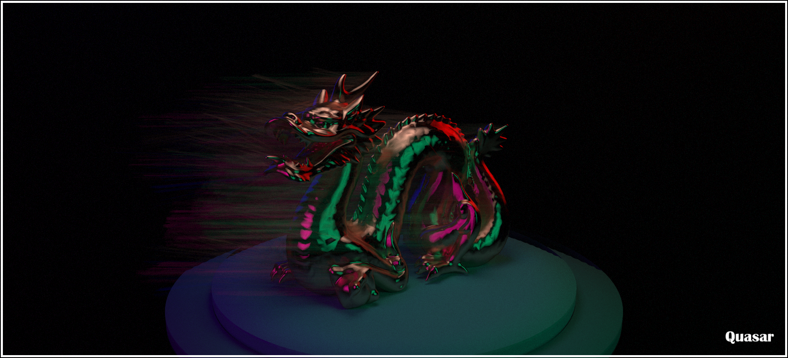
   
  <em>A Hero Render</em>

After spending months and casting trillions of rays, all the work has finally cumulated into "Quasar" - my very own Rendering Engine based on Path Tracing. The Hero Render is a testimony to our statement, a dragon - which symbolizes power, courage and authority.

This repository contains a c++ and python implementation for the rendering engine, albeit python is used just to upscale images, as a post processing effect, wherever required. In the next few sections, I will walk you through the feature set and will conclude by mentioning the plans for future.

## GLB / GLTF 

  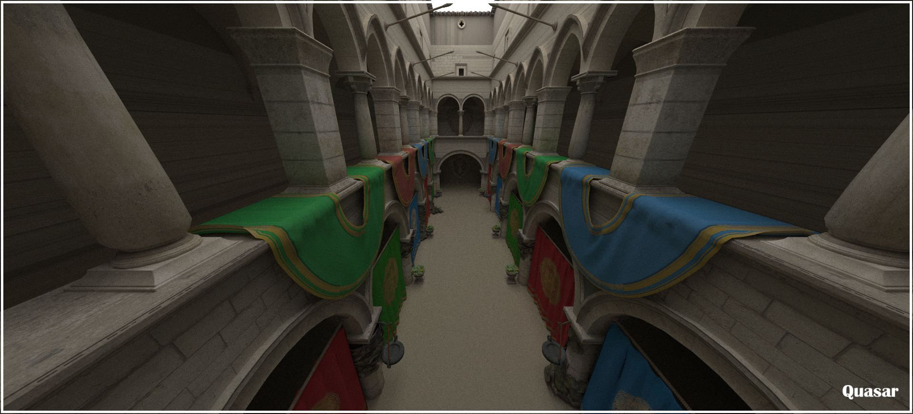
   
  <em>Classic Sponza Atrium</em>

Creating complex scenes using basic shapes with code becomes cumbersome really fast. Loading models through GLB / GLTF was an envitable feature. Quasar uses Assimp for interpreting the GLB / GLTF file and load the geometry /  material information in memory. The read information is stored into an in-memory format that Quasar uses to render visuals on screen. 

As of now, everything is loaded as triangles, for materials GLTF format uses Principled BSDF approach with KHR extensions wherever needed. Quasar has the ability to work with:
- Diffuse Color
- Diffuse Texture
- Normal Map

Additionally, it can interpret UVs, Normals, Tangents and Bi-Tangents. The remaining values of Principled BSDF are a WIP, being implemented as Disney BRDF.

## Shading

  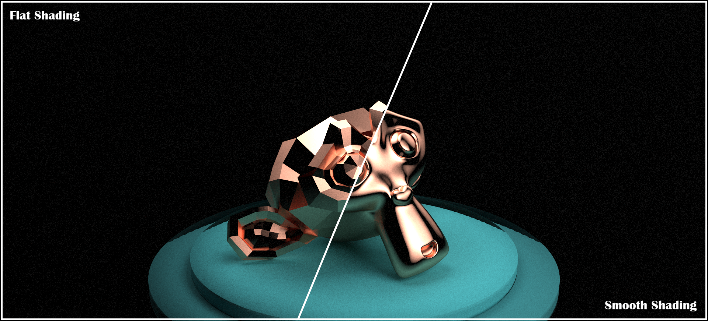
   
  <em>Shading Types</em>

Lighting is mostly a play of normals and how we reflect the incoming ray. This leads to the following two cases:
- Flat Shading: Use vertex normals
- Smooth Shading: Use nighbouring normals 

Fortunately, Quasar is capable of working with both the situations. All one has to do is make sure the appropriate shading mode is applies before exporting GLB / GLTF.

## Lights

  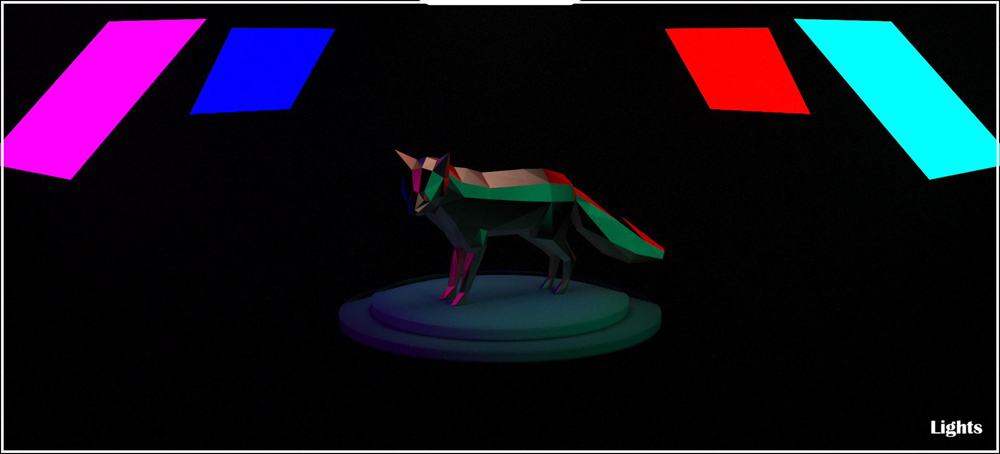
   
  <em>Metal Fox</em>

In Quasar, there are two types of light sources:
- Ambient
- Sources casting lights

The engine itself supports Global Illumination, as a result of the Path Tracing algorithm, which means it will convey the physics of light upto a certain extent. In this case, the colors from different light sources get mixed and result into a 3rd color. The current implementation includes lights as a material, so all one has to do is apply a material to mesh.

## Textures

  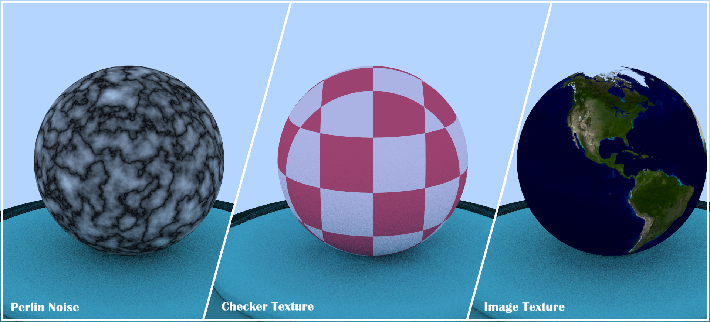
   
  <em>Metal Fox</em>

Textures help us to add the intricacies to the materials, they are also an important part of material pipeline in Quasar. The reason being even solid colours are implemented as Textures to maintain uniformity.

There are 2 types of textures in the pipeline:
- Procedural: Perlin Noise + Checkers
- Image

Like any other library, Textures are loaded asna separate entity, then attached to the material to be used during Rendering. One important thing for Image Textures is UV coordinates, which can either be loaded through GLB / GLTF or computed on the fly using barycentric coordinates

## Motion Blur

  
   
  <em>Metal Fox</em>

Motion blur is a visual effect that simulates the streaking or blurring of moving objects in a scene, caused by the relative motion between the camera and objects during the exposure time of a frame. In our case, the camera always stays stable and the object moves, this movement is described by assigning two positions to our desired object: the start position and the end position

The Hero Render is a good example that encapsulates the entire idea, it also proves how true out implementation is to physical reality as it shows all the reflections of the surrounding light whilst being in motion.

## Bounding Volume Hierarchies ( BVH )

A BVH (Bounding Volume Hierarchy) is a tree structure used to accelerate ray tracing by organizing scene geometry into nested bounding volumes, enabling efficient ray-object intersection tests, which in turn translates directly to improved rendering time. Earlier, without BVH, certain scenes took 12-14 hours, but with BVH that time came down to 1 hour

## Ambient Light

  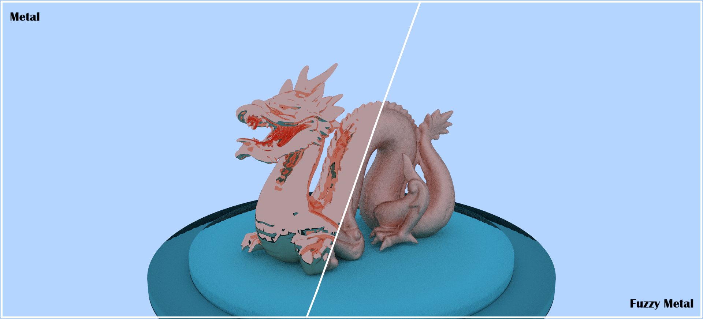
   
  <em>Metal Fox</em>

Ambient light is the base layer of general illumination that fills a space, providing the overall brightness and establishing the mood or atmosphere. This feature also implies that we don't need any explicit light as the ambient light will contribute enough to generate a visually appealing result, albeit that depends upon the configuration of the Ambient Light.

## Normal Map

  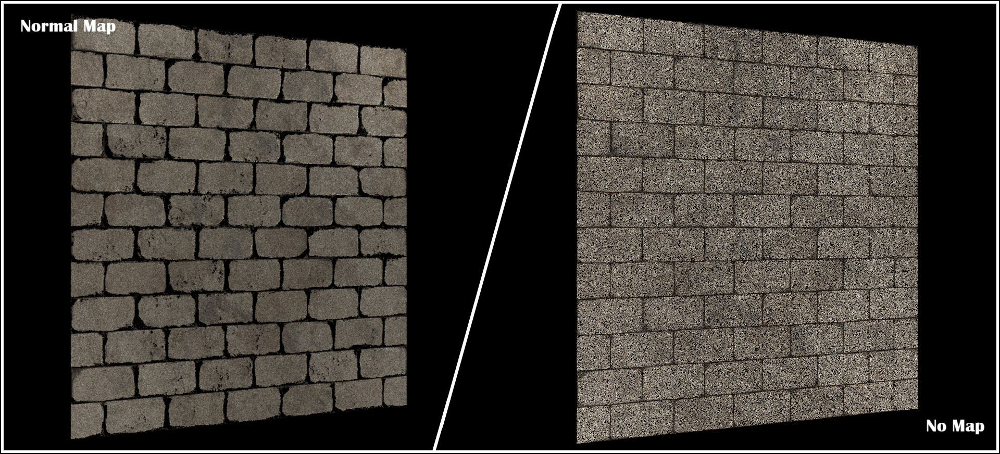
   
  <em>Metal Fox</em>

Normal maps deserve their own section because of the sweet maths that goes behind them. Tangents, Bi-Tangents and Normals are the driving factor in this case. This orthogonal basis can either be loaded from GLB / GLTF or Quasar can generate them on the fly, just like UVs

A normal map is a texture map in 3D computer graphics that stores directional information in an RGB image to simulate fine surface detail, such as bumps, grooves, and scratches, without altering the model's actual geometry. It basically modifies how light reflects off of a surface.

Normal maps are pretty crucial, because if properly configured thay bring us closer to realism. 

## Cornell Box

  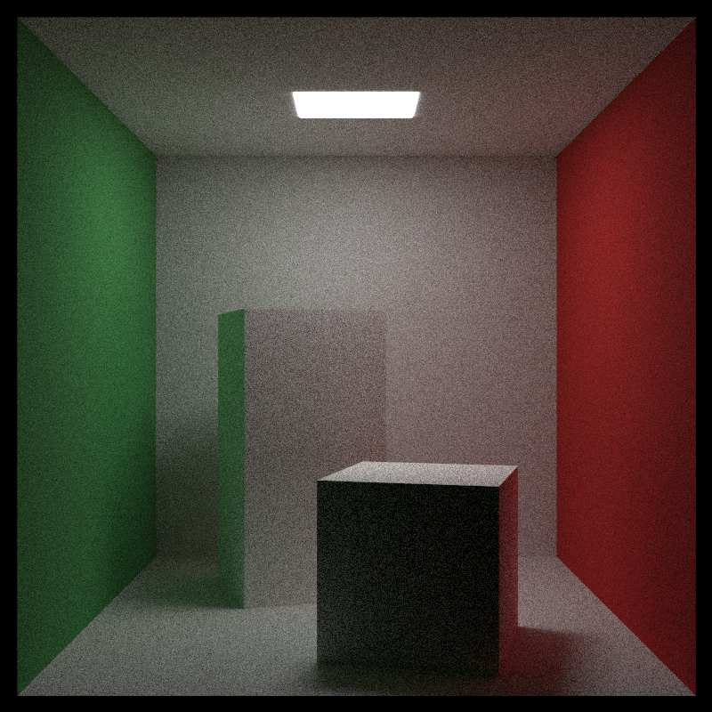
   
  <em>Metal Fox</em>

The Cornell box is a test scene designed to evaluate the accuracy of rendering software by comparing a rendered image with a photograph of a real-world model under the same lighting conditions.

Here's a visual for Cornell's Box rendered using Quasar.

## Volumetrics

  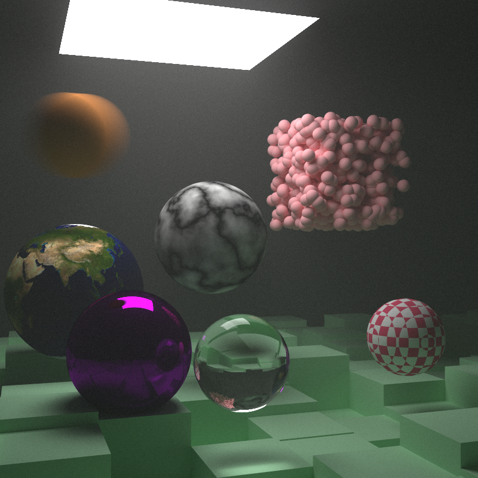
   
  <em>Metal Fox</em>

Volumetrics is the idea of simulating and rendering participating medium. Mediums that scatter, absorb or emit light as it travels through them. Examples like: Fog, Smoke, Dust and Most.

Quasar has implemented them in the form of a Texture / Material, one has to define the boundary of such a medium using a Mesh and then use the provided Isotropic Material, configure the density of the medium and voila! You have a Fog or mist or anything in between or outside depending upon the density.

## Material Showcase

### Basic Materials

This section demonstrates different materials that exist, and how they interact with light ( with respect to physics ). Each Material implemented, takes care of two things: ***attenuation*** and ***scattering***. And depending upon just two factors we have created a bunch of materials ( kind of nuanced explanation ). A quick glance at list of materials that are present in the code base:
- Normal
- Diffuse 
- Solid
- Metal
- Dielectric

<table>
  <tbody>
    <tr>
      <td >
        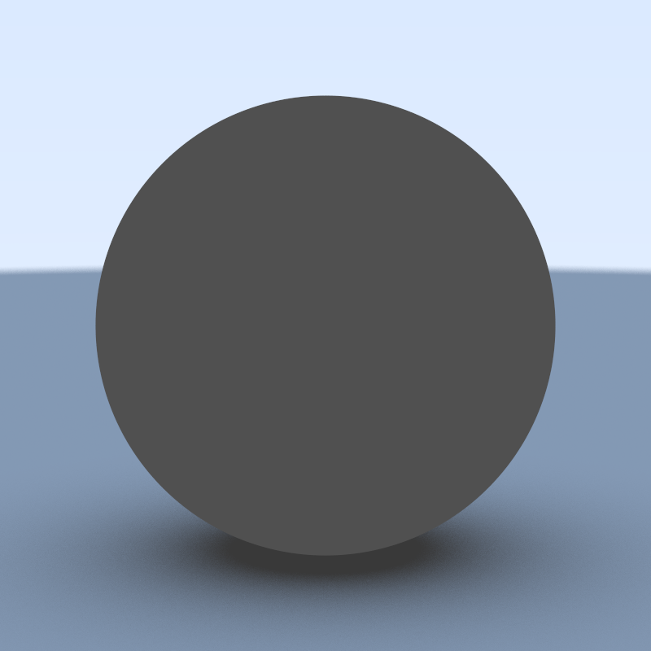
        

          Solid - Flat-colored material,
        

      </td>
      <td>
        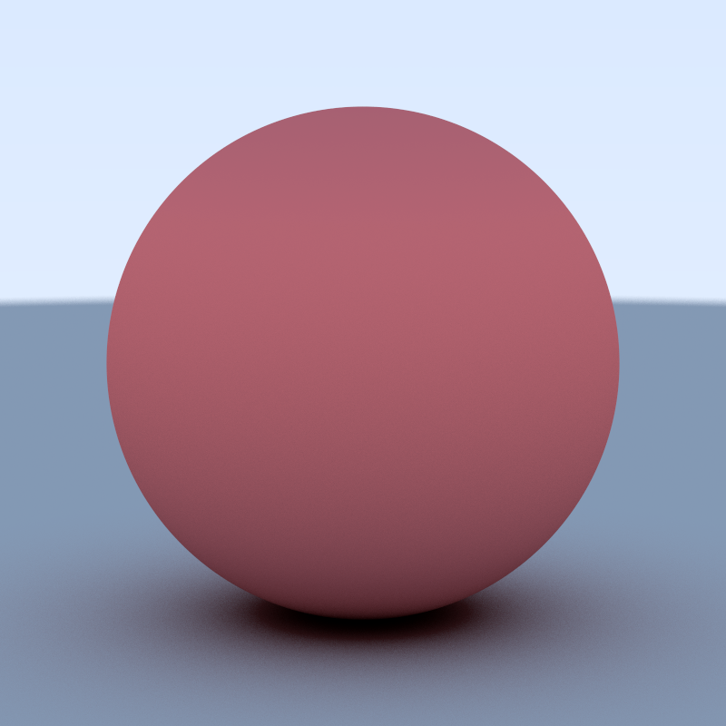
        

          Diffuse - A Lambertian surface that scatters light evenly in all directions.
        

      </td>
      <td>
        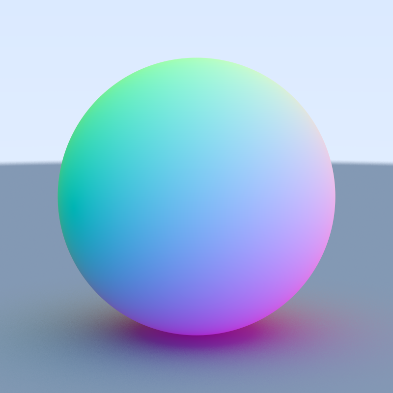
        

          Normal - Visualizes the normal vectors
        

      </td>
    </tr>
  </tbody>
</table>

### Metal

Metal, as a material consists of two major properties: ***reflectance*** and ***color*** of the metal itself. The reflectance can also have a "***fuzz***" factor, just like in real life. Below you can see a progression of fuzz factor from shiny metal ball to almost diffuse metal ball ( acts just like a diffuse spehre material )

<table>
  <tbody>
    <tr>
      <td >
        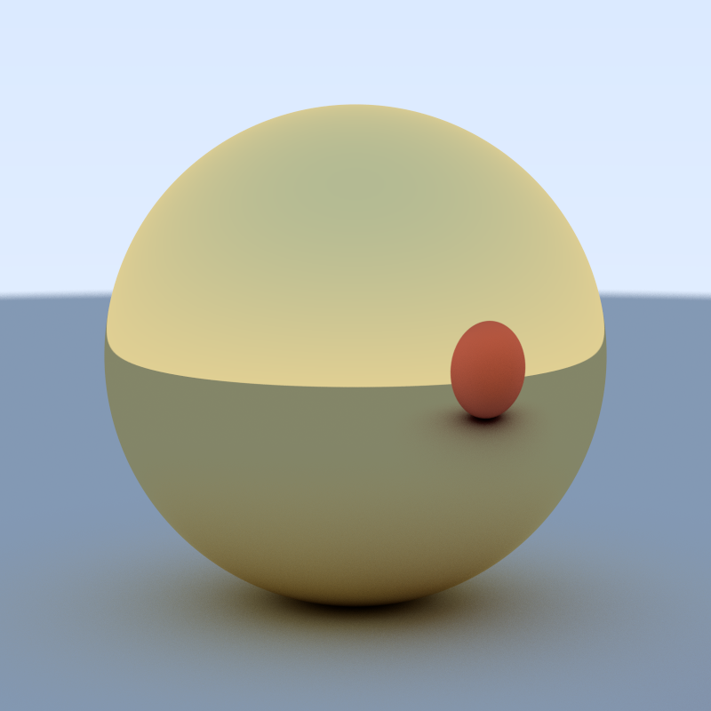
        

          Metal - 0 fuzz
        

      </td>
      <td>
        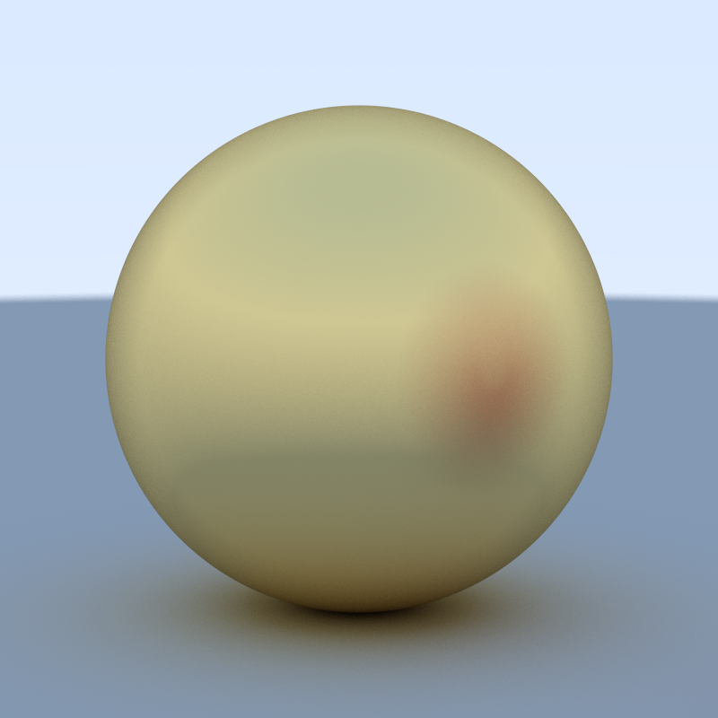
        

          Metal 0.5 fuzz
        

      </td>
      <td>
        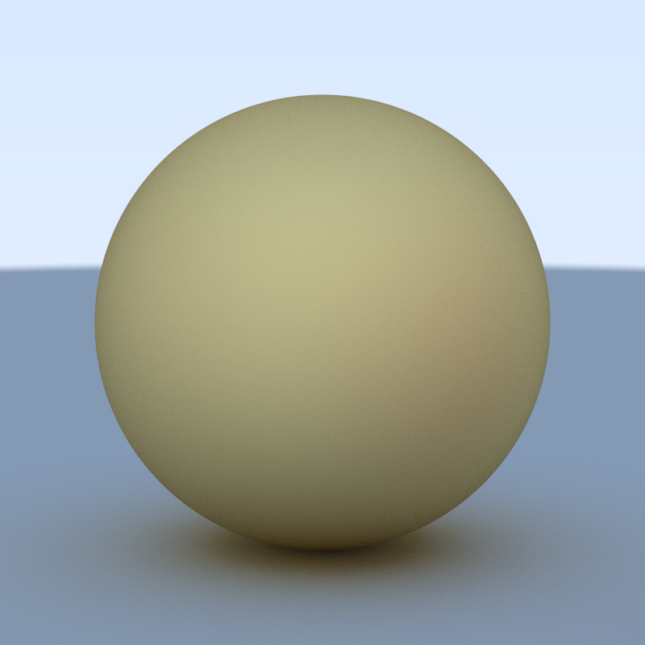
        

          Metal 1 fuzz
        

      </td>
    </tr>
  </tbody>
</table>

Just to showcase the "magic" of PathTracing, I have also created the following two scenarios:
- ***metal + metal reflections***: You can see the infinite reflection pattern on both the spheres ( just like real life )
- ***metal + dielectric reflections***: You can see the faint reflections of a glass sphere and also the glass sphere reflecting + refracting the metal sphere

<table>
  <tbody>
    <tr>
      <td >
        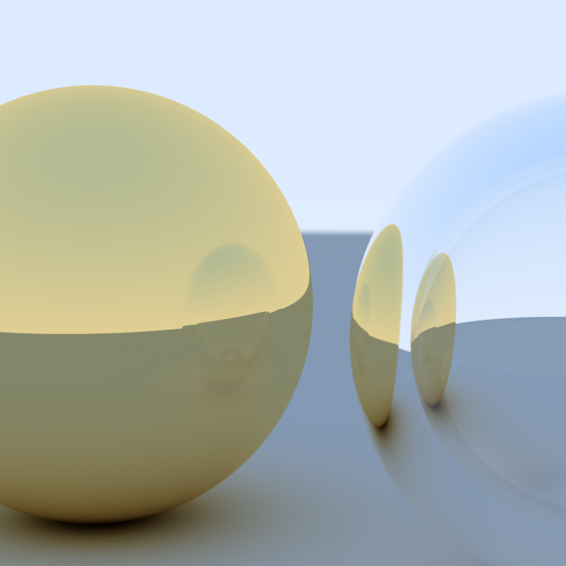
        

          Dielectric Reflecting Into Metal
        

      </td>
      <td>
        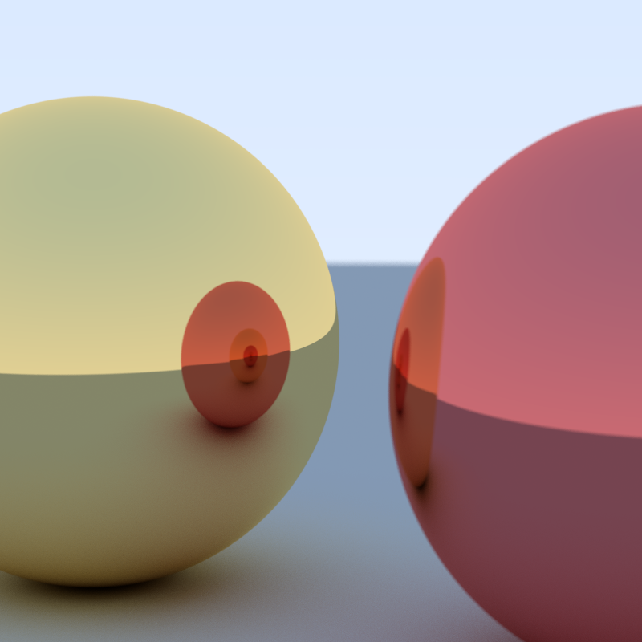
        

          Metal Reflecting Into Metal
        

      </td>
    </tr>
  </tbody>
</table>

###  Dielectric

***Dielectrics*** are materials that are weak conductors of electricty, like wool, water, sand, air etc.. Here we tried to simulate "***glass***" and that too with reflection, refraction and total internal reflection. You might feel that the glass balls are floating due to abscence of shadow but even in real life glass balls rarely have a dense shadow. If you focus at the bottom center of the sphere, you might see a faint patch of shadow

<table>
  <tbody>
    <tr>
      <td >
        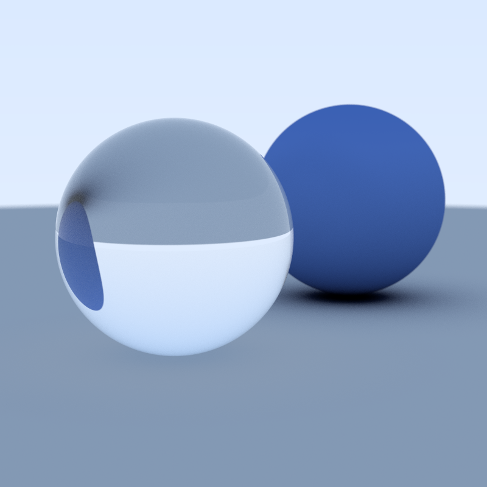
        

          Dielectric - RI: ( 1.00 / 1.33 )
        

      </td>
      <td>
        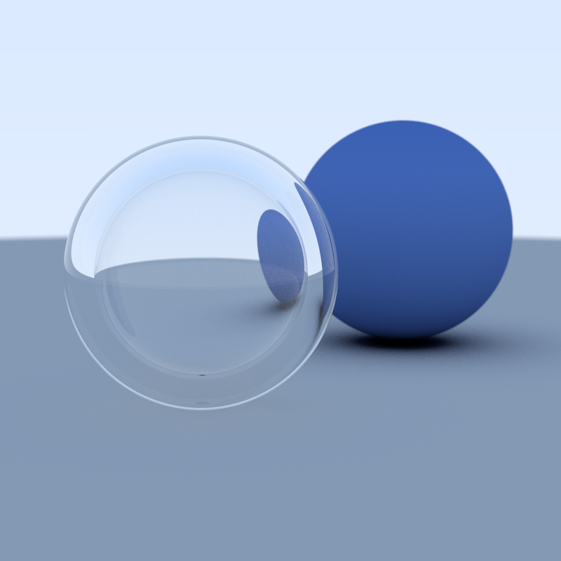
        

          Dielectric Inside Dielectric - RI1 ( outer ): ( 1.50 ) + RI2 ( inner ): ( 1.00 / 1.50 )
        

      </td>
    </tr>
  </tbody>
</table>

## Anti - Aliasing

<table>
  <tbody>
    <tr>
      <td >
        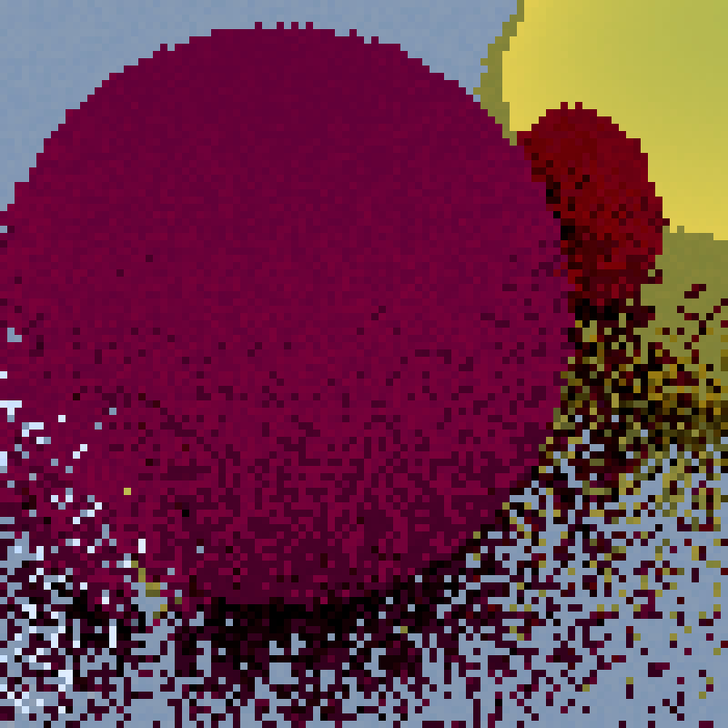
        

          SPP 1
        

      </td>
      <td>
        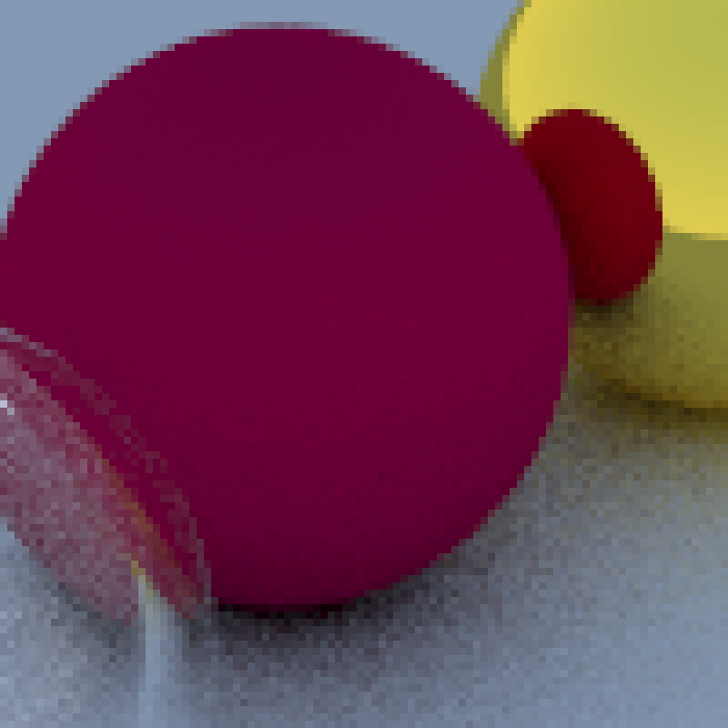
        

          SPP 100
        

      </td>
      <td>
        
        

          SPP 500
        

      </td>
    </tr>
  </tbody>
</table>

Anti-Aliasing helps reduce the jagged, stair-step edges that can appear in digital images, especially along diagonal lines or curves. In the real world, visual information is continuous, but in a rendered image, we approximate it with a grid of discrete pixels. By taking multiple samples per pixel and averaging the results, anti-aliasing creates smoother transitions and more realistic gradients, resulting in a cleaner and more natural-looking image.

## Depth of Field ( DOF )

You already must have had experience with depth of Field, when you click photos or even watch vlogs on youtube. You might see that the speaker is sharp but the background is blurred, that is due to depth of field

The "Field" in "Depth of Field" is merely an area in which objects appear sharp, the "Depth" in "Depth of Field" is like "how deep is the field", and mostly we are interested in controlling this so called "Depth". Unfortunately for us, according to our current implementation ( based on book ), we wouldn't be able to control the "deepness" of the field, rather for us ~ it's a "field" where object will appear in focus but more like a "Plane" and what ever is in the plane region will appear sharp. Things further before or after the plane will get blurred.

Two things can control Depth of Field:
- De-focus Angle: If there is a blur section in an image, then how much to blur it
- De-focus Distance: When to place the plane, at this distance everything will be sharp

#### De-focus Angle "How much to blur the blurry regions"

<table>
  <tbody>
    <tr>
      <td >
        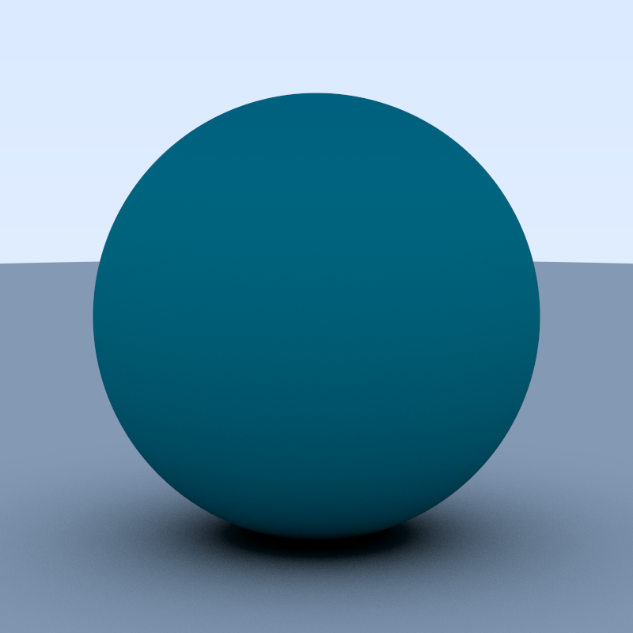
        

          Defocus Angle 1.0
        

      </td>
      <td>
        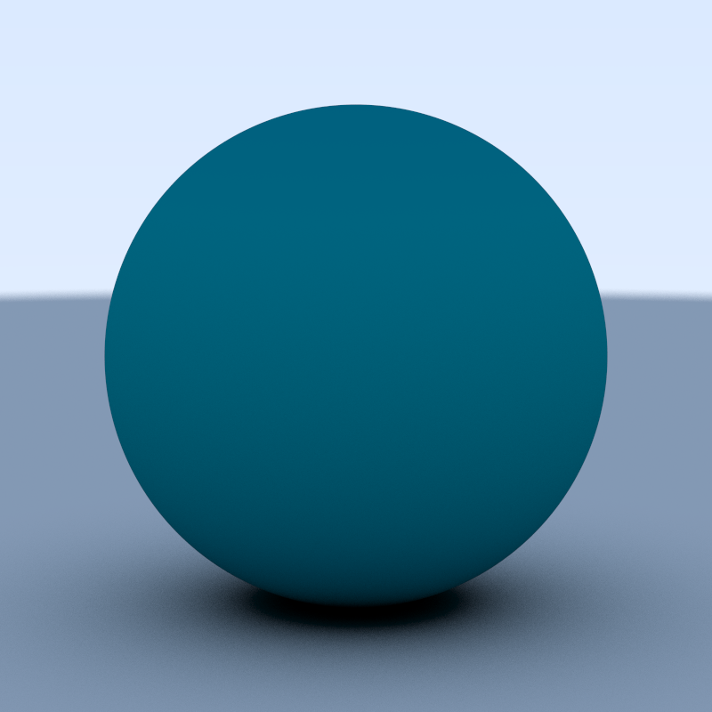
        

          Defocus Angle 0.5
        

      </td>
      <td>
        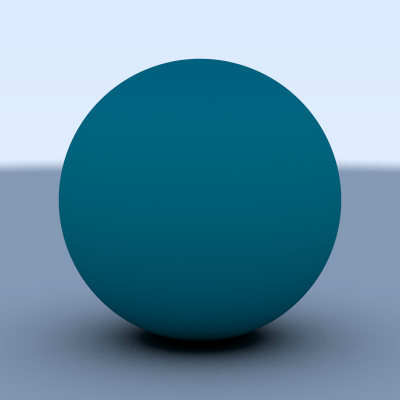
        

          Defocus Angle 1.0
        

      </td>
    </tr>
  </tbody>
</table>

#### De-focus Distance "What region should appear sharp"

<table>
  <tbody>
    <tr>
      <td >
        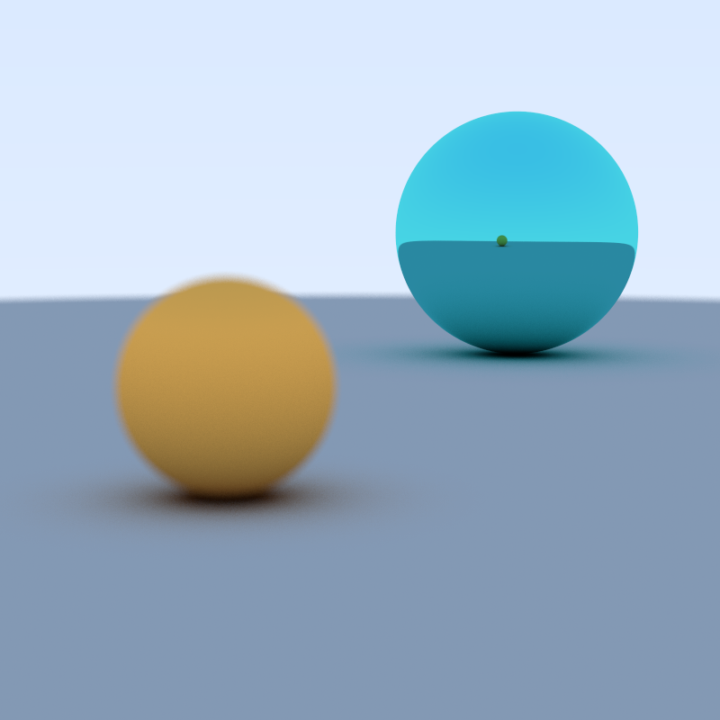
        

          Defocus Distance
        

      </td>
      <td>
        
        

          Defocus Distance
        

      </td>
    </tr>
  </tbody>
</table>

## FOV

Field of View controls how wide the camera can see. A smaller FOV gives a zoomed-in, narrow perspective, while a larger FOV creates a wide-angle view. We use vFOV here, but also hFOV would have been fine. In our case we supply the vFOV and the dimensions are automatically adjusted

<table>
  <tbody>
    <tr>
      <td >
        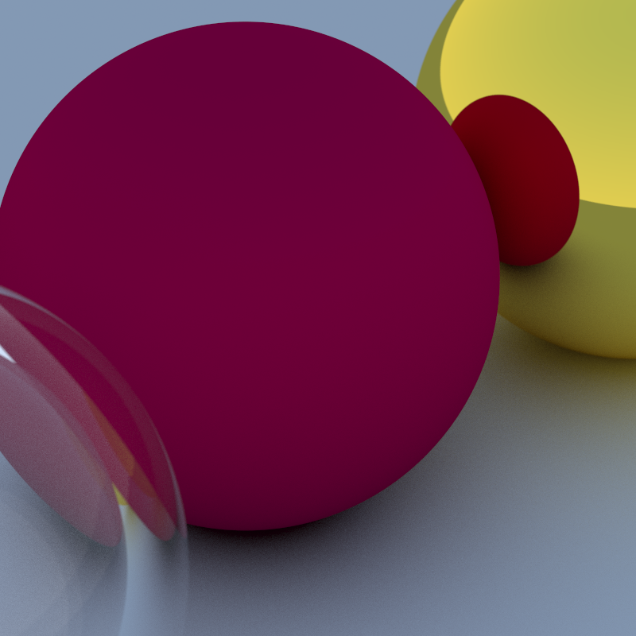
        

          FOV 20
        

      </td>
      <td>
        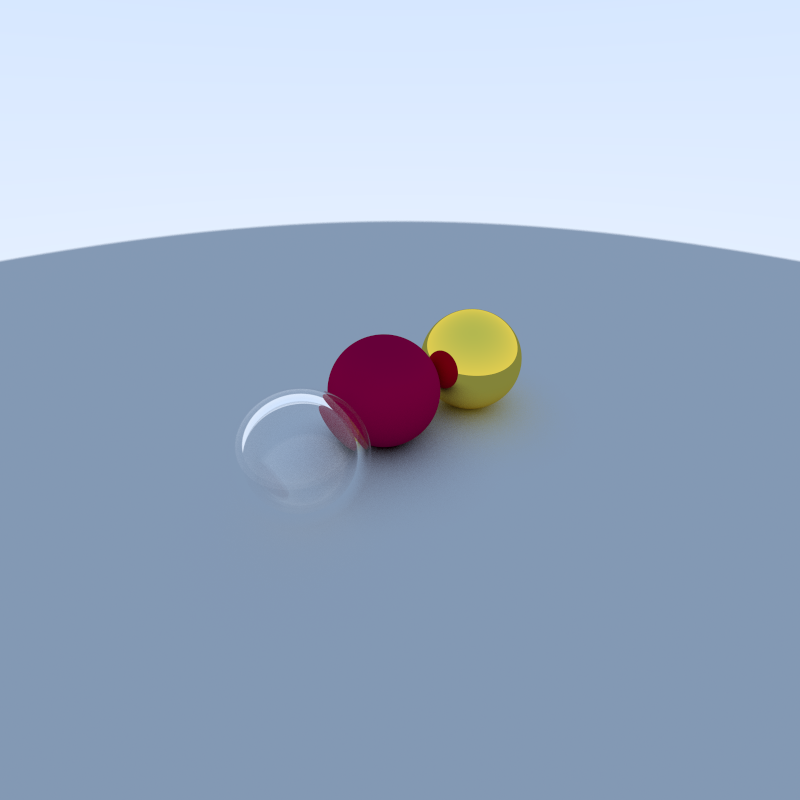
        

          FOV 90
        

      </td>
    </tr>
  </tbody>
</table>

## Max Depth & SPP

In ray tracing, max depth defines the maximum number of times a ray is allowed to bounce (or recurse) before it's terminated. Each bounce represents a light interaction — such as reflection, refraction, or scattering.

In Ray Tracing in One Weekend, this is used to avoid infinite recursion and control render time. A ray that exceeds the max depth is assumed to contribute no more light, and its color is set to black

- A lower max depth results in faster renders but may miss deeper reflections or refractions.
- A higher max depth produces more realistic images, especially for transparent or reflective materials, but is computationally more expensive.

<table>
  <tbody>
    <tr>
      <td >
        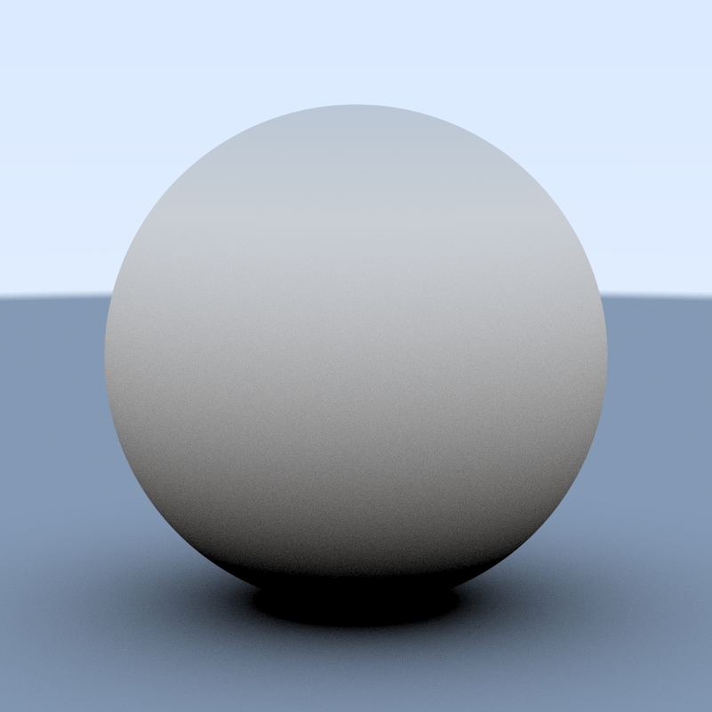
        

          Max Depth 2 SPP 500
        

      </td>
      <td>
        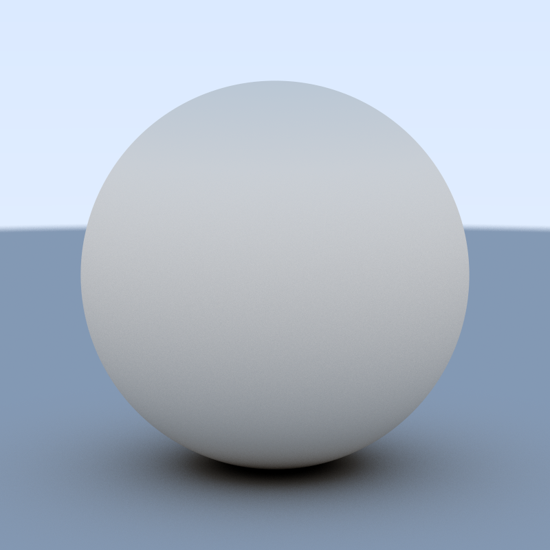
        

          Max Depth 10 SPP 500
        

      </td>
      <td>
        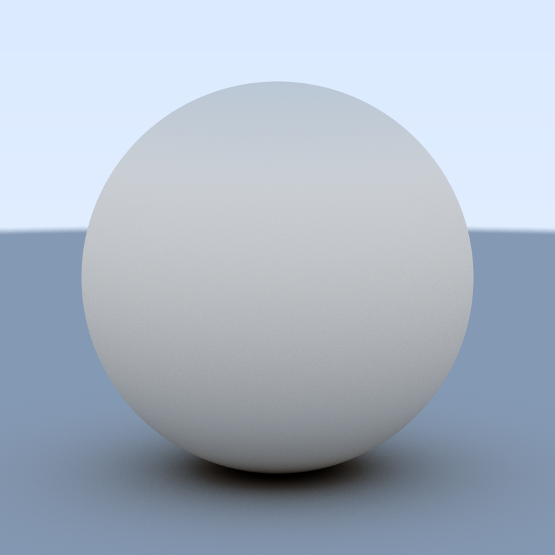
        

          Max Depth 50 SPP 500
        

      </td>
    </tr>
  </tbody>
</table>

SPP controls how many rays are shot per pixel to estimate its final color. Instead of casting just one ray, multiple rays with slight random offsets are averaged to reduce noise and achieve anti-aliasing. 
Fun Fact: Since SPP adds extra rays, the extra rays tend to be additional cost. DOF uses this additional cost to it's benefit and implements the blur effect

<table>
  <tbody>
    <tr>
      <td >
        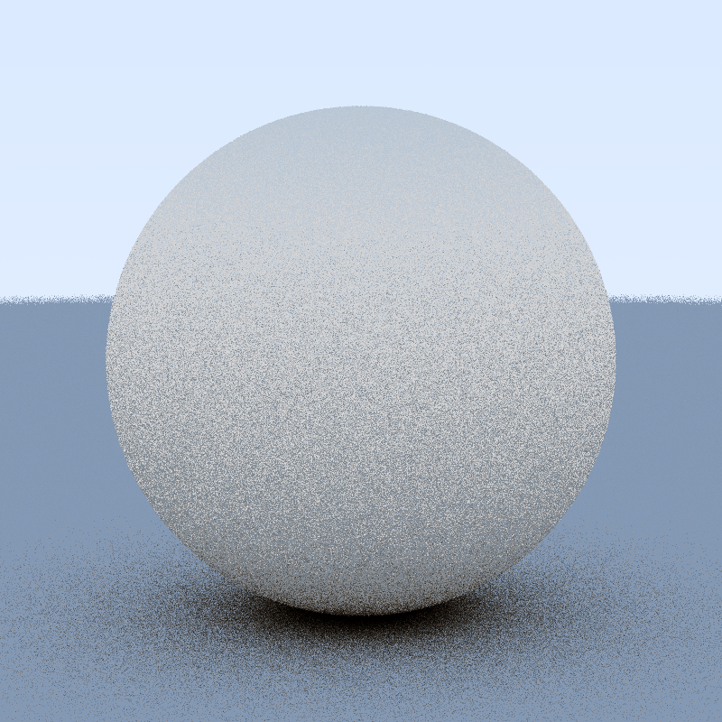
        

          Max Depth 50 SPP 2
        

      </td>
      <td>
        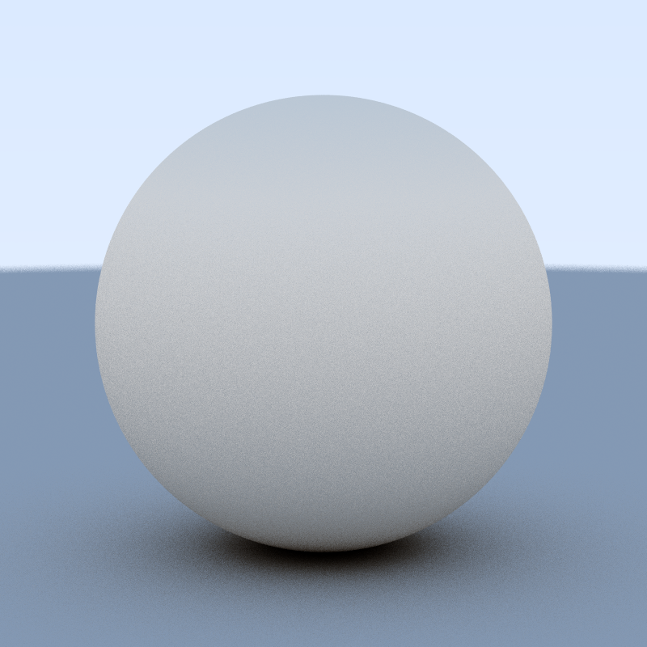
        

          Max Depth 50 SPP 50
        

      </td>
      <td>
        
        

          Max Depth 50 SPP 500
        

      </td>
    </tr>
  </tbody>
</table>

## Low Depth + Low SPP and Bounced Reflections

You can see that low Depth + low SPP, would result into a grainy and dark image because not enough rays are spawned which results in bad sampling and low Depth causes less infoinformation to be gathered. In the right image, you can see that a image generated with good parameters would give a good anti-aliased + tinted reflections + smooth image

<table>
  <tbody>
    <tr>
      <td >
        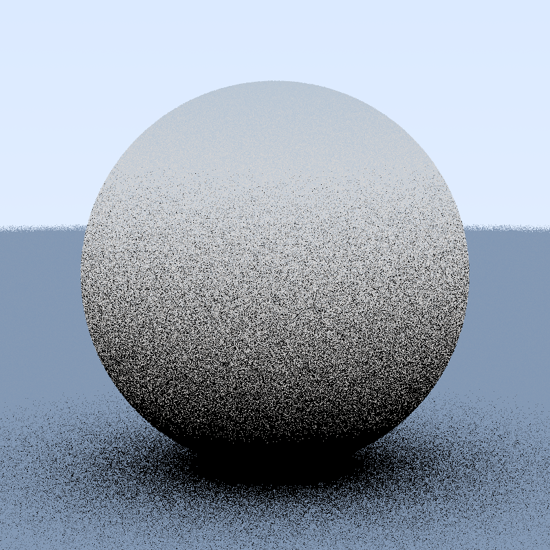
        

          Max Depth 2 SPP 2
        

      </td>
      <td>
        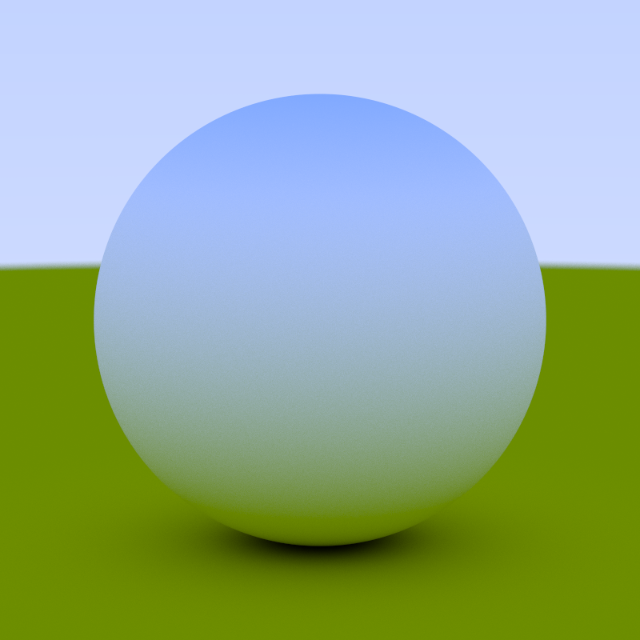
        

          Bounced Reflections
        

      </td>
    </tr>
  </tbody>
</table>

## Mesh Types and Transformations

Quasar has a few in built types of geometries, which can be extended further easily. Majorly there are two types of geometries:
- Primitives ( Sphere / Quad / Triangle )
- Composites ( Composites / Primivites )

Each of them are described by pure mathematical functions. These equations not only allow us to implement the geometry but also transform them using the following operations:
- Rotation
- Translation

These implementations use a clever trick of transforming the ray to the local coordinate system, rather than updating the geometrical data representing the geomtry

Note: When reading the GLB, we just take the data and convert to our class of Triangles and Composites

## Multi-threading

The nature of graphics rendering is embarrassingly parallel, it's like "hey, this is the process to calculate the color of a pixel, can you apply it to millions of pixels"?

If we don't use this fact to our advantage then we are loosing a lot. That's why, I decided to add Multi-threading.

The Multi-Threading is managed by a thread pool,which allows us to have a lot more control over the the threads themselves. In order to avoid blocking the main thread we spawn N threads, depending upon hardware concurrency, and then use N-1 of them for rendering and 1 thread for updating the UI, this process results into a seamless non-blocking workflow.

The idea is to spawn max pure hardware threads, divide the image into Tiles depending upon number of threads and a multiplier. Ask each thread to compute values for the assigned Tile, write into image buffer and save the buffer to file.

Once a thread finishes rendering a Tile, it grabs the next tile randomly.

We do get a huge speed boost, anywhere from 5.5x to 24x ( upper limit being number of pure hardware threads ). As an example the volumetrics render of this repo, took around 1.4 hours to render, whereas without multi threading i believe it would have taken anywhere from 12 hours to 20 hours

The Volumetrics scene is massive and complex: 1000 spheres, caustics, Fog, 10k samples per pixel and 40 as depth for each recursed ray.

For other small scenes in here, i could see time going down from mins to seconds or hours to mins.

## UI

https://github.com/user-attachments/assets/c5a35ebc-be32-4be4-a020-530870df95fb

Qusar uses SFMl to display the result into window, the result is refreshed every few milliseconds. It consists of auto-save which is triggered the moment rendering is done, if one wants to save manually then pressing "s" can do that. Additionally, it also displays some additional information towards the top-left cornerof the window
